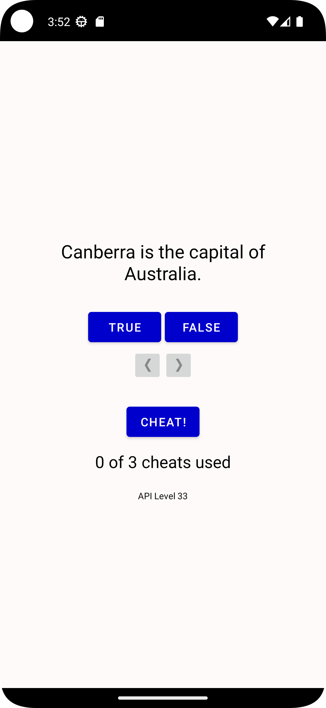
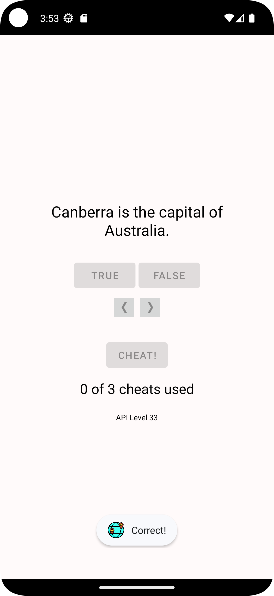
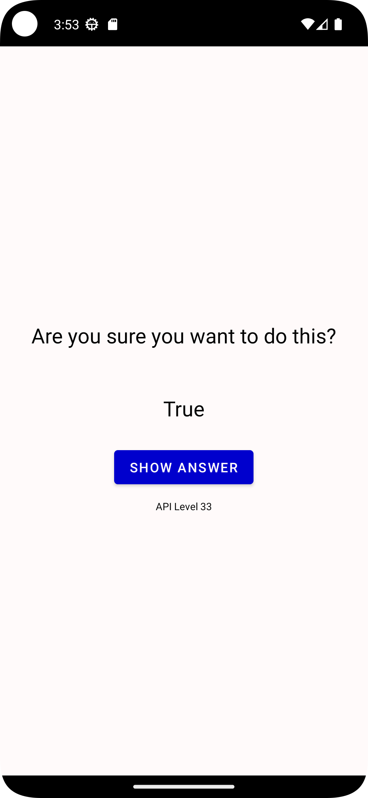
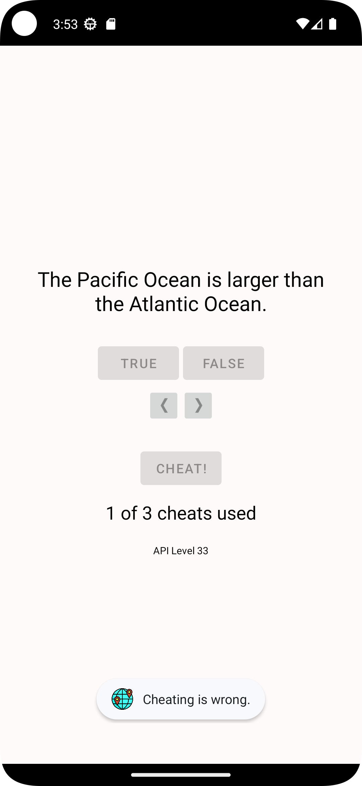
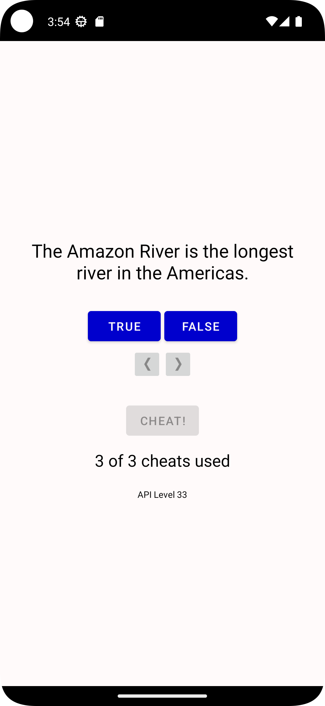
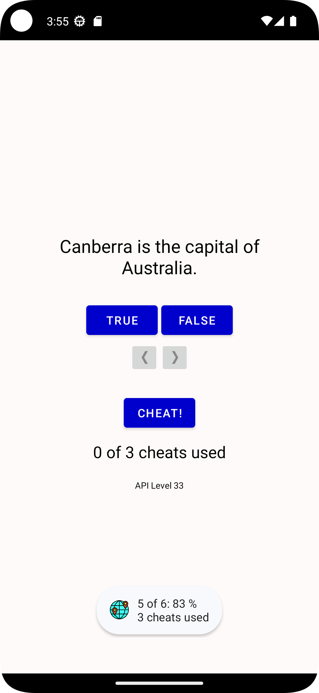
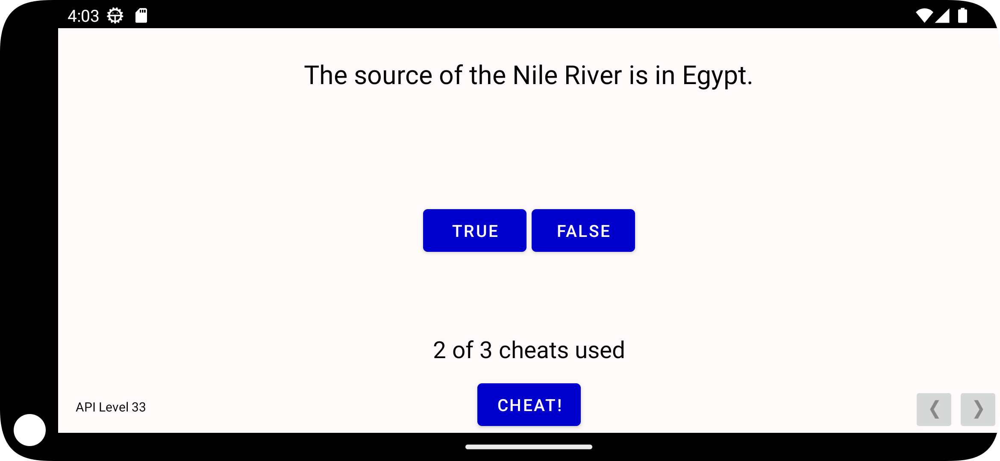
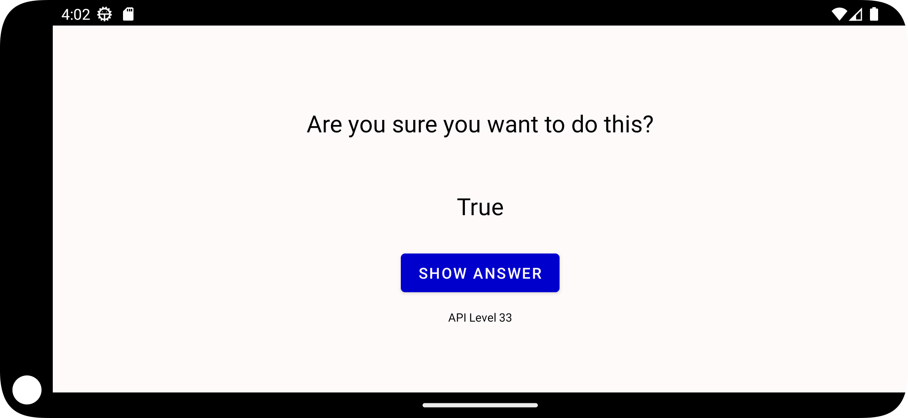

# GeoQuiz
## The first android app from Android Programming: The Big Nerd Ranch Guide, 4th Edition

## [App icon](https://www.flaticon.com/free-icon/geo_4350980?related_id=4350921&origin=search)


<div align="center">
     
     
     
     
     
     
     
     
</div>

### MainActivity.kt
```kt
package com.example.geoquiz

import android.annotation.SuppressLint
import android.app.Activity
import android.content.Intent
import androidx.appcompat.app.AppCompatActivity
import android.os.Bundle
import android.util.Log
import android.widget.Button
import android.widget.ImageButton
import android.widget.TextView
import android.widget.Toast
import androidx.lifecycle.ViewModelProvider
import androidx.lifecycle.ViewModelProviders
import kotlin.math.roundToInt

private const val TAG = "MainActivity"
private const val KEY_INDEX = "index"
private const val REQUEST_CODE_CHEAT = 0

class MainActivity : AppCompatActivity() {

    private lateinit var questionTextView: TextView
    private lateinit var trueButton:Button
    private lateinit var falseButton:Button
    private lateinit var nextButton:ImageButton
    private lateinit var prevButton:ImageButton
    private lateinit var cheatButton: Button
    private lateinit var cheatTextView: TextView

    @SuppressLint("SetTextI18n")
    private fun updateState(){

        if (quizViewModel.checked[quizViewModel.currentIndex] == 1){
            falseButton.isEnabled = false
            trueButton.isEnabled = false
        }
        else {
            falseButton.isEnabled = true
            trueButton.isEnabled = true
        }

        cheatButton.isEnabled =
            !(quizViewModel.isCheater.count() {it} > 2 || quizViewModel.isCheater[quizViewModel.currentIndex] || quizViewModel.checked[quizViewModel.currentIndex] == 1)

        if (quizViewModel.checked.sum() == quizViewModel.answers.size){
            val res = "${quizViewModel.answers.sum()} of ${quizViewModel.answers.size}: ${(quizViewModel.answers.sum().toDouble() / quizViewModel.answers.size * 100).roundToInt()} %\n${quizViewModel.isCheater.count() {it}} cheats used"
            Toast.makeText(this, res, Toast.LENGTH_LONG).show()

            quizViewModel.default()

            falseButton.isEnabled = true
            trueButton.isEnabled = true
            cheatButton.isEnabled = true
        }

        cheatTextView.text = "${quizViewModel.isCheater.count() {it}} of 3 cheats used"

    }

    private fun updateQuestion() {
        val questionTextResId = quizViewModel.currentQuestionText
        questionTextView.setText(questionTextResId)
    }

    private fun checkAnswer(userAnswer: Boolean){
        val correctAnswer: Boolean = quizViewModel.currentQuestionAnswer

        val messageResId = when {
            quizViewModel.isCheater[quizViewModel.currentIndex] -> R.string.judgment_toast
            userAnswer == correctAnswer -> R.string.correct_toast
            else -> R.string.incorrect_toast
        }

        if (correctAnswer == userAnswer)
            quizViewModel.answers[quizViewModel.currentIndex]++

        quizViewModel.checked[quizViewModel.currentIndex]++

        Toast.makeText(this, messageResId, Toast.LENGTH_SHORT).show()
    }

    private val quizViewModel: QuizViewModel by lazy {
        ViewModelProviders.of(this).get(QuizViewModel::class.java)
    }

    @SuppressLint("SetTextI18n")
    override fun onCreate(savedInstanceState: Bundle?) {
        super.onCreate(savedInstanceState)
        Log.d(TAG, "onCreate(Bundle?) called")
        setContentView(R.layout.activity_main)

        val currentIndex = savedInstanceState?.getInt(KEY_INDEX, 0) ?: 0
        quizViewModel.currentIndex = currentIndex

        val provider: ViewModelProvider = ViewModelProviders.of(this)
        val quizViewModel = provider.get(QuizViewModel::class.java)
        Log.d(TAG, "Got a QuizViewModel: $quizViewModel")

        trueButton = findViewById(R.id.true_button)
        falseButton = findViewById(R.id.false_button)
        nextButton = findViewById(R.id.next_button)
        prevButton = findViewById(R.id.prev_button)
        cheatButton = findViewById(R.id.cheat_button)
        questionTextView = findViewById(R.id.question_text_view)
        cheatTextView = findViewById(R.id.cheats_used_text_view)

        val apiLevelTextView: TextView = findViewById(R.id.api_level_text_view)
        apiLevelTextView.text = "API Level ${android.os.Build.VERSION.SDK_INT}"

        trueButton.setOnClickListener {
            checkAnswer(true)
            updateState()
            updateQuestion()
        }

        falseButton.setOnClickListener {
            checkAnswer(false)
            updateState()
            updateQuestion()
        }

        nextButton.setOnClickListener{
            quizViewModel.moveToNext()
            updateState()
            updateQuestion()
        }

        prevButton.setOnClickListener{
            quizViewModel.moveBack()
            updateState()
            updateQuestion()
        }

        cheatButton.setOnClickListener {
            val answerIsTrue = quizViewModel.currentQuestionAnswer
            val intent = CheatActivity.newIntent(this@MainActivity, answerIsTrue)

            startActivityForResult(intent, REQUEST_CODE_CHEAT)
        }

        updateState()
        updateQuestion()

        Log.d(TAG, "Current question index: $currentIndex")
        try {
            val question = quizViewModel.currentQuestionText
        } catch (ex: ArrayIndexOutOfBoundsException) {
            Log.e(TAG, "Index was out of bounds", ex)
        }
    }

    override fun onStart() {
        super.onStart()
        Log.d(TAG, "onStart() called")
    }
    override fun onResume() {
        super.onResume()
        Log.d(TAG, "onResume() called")
    }
    override fun onPause() {
        super.onPause()
        Log.d(TAG, "onPause() called")
    }
    override fun onSaveInstanceState(savedInstanceState: Bundle) {
        super.onSaveInstanceState(savedInstanceState)
        Log.i(TAG, "onSaveInstanceState")
        savedInstanceState.putInt(KEY_INDEX, quizViewModel.currentIndex)
    }
    override fun onStop() {
        super.onStop()
        Log.d(TAG, "onStop() called")
    }
    override fun onDestroy() {
        super.onDestroy()
        Log.d(TAG, "onDestroy() called")
    }

    @Deprecated("Deprecated in Java")
    override fun onActivityResult(requestCode: Int,
                                  resultCode: Int,
                                  data: Intent?) {
        super.onActivityResult(requestCode, resultCode, data)
        if (resultCode != Activity.RESULT_OK) {
            return
        }
        if (requestCode == REQUEST_CODE_CHEAT) {
            quizViewModel.isCheater[quizViewModel.currentIndex] =
                data?.getBooleanExtra(EXTRA_ANSWER_SHOWN, false) ?: false
        }

        updateState()
        updateQuestion()
    }
}
```

### QuizViewModel.kt
```kt
package com.example.geoquiz

import androidx.lifecycle.ViewModel

class QuizViewModel : ViewModel() {

    private val questionBank = listOf(
        Question(R.string.question_australia, true),
        Question(R.string.question_oceans, true),
        Question(R.string.question_mideast, false),
        Question(R.string.question_africa, false),
        Question(R.string.question_americas, true),
        Question(R.string.question_asia, true)
    )

    var currentIndex = 0
    var answers = IntArray(questionBank.size)
    var checked = IntArray(questionBank.size)
    var isCheater = BooleanArray(questionBank.size)

    fun default(){
        currentIndex = 0
        answers = IntArray(questionBank.size)
        checked = IntArray(questionBank.size)
        isCheater = BooleanArray(questionBank.size)
    }

    val currentQuestionAnswer: Boolean
        get() = questionBank[currentIndex].answer
    val currentQuestionText: Int
        get() = questionBank[currentIndex].textResId

    fun moveToNext() {
        if (currentIndex < questionBank.size - 1)
            currentIndex = (currentIndex + 1) % questionBank.size
    }

    fun moveBack(){
        if (currentIndex > 0)
            currentIndex = (currentIndex - 1) % questionBank.size
    }
}
```

### CheatActivity.kt
```kt
package com.example.geoquiz

import android.annotation.SuppressLint
import android.app.Activity
import android.content.Context
import android.content.Intent
import androidx.appcompat.app.AppCompatActivity
import android.os.Bundle
import android.util.Log
import android.widget.Button
import android.widget.TextView

private const val TAG = "CheatActivity"
private const val KEY_INDEX = "answer"

const val EXTRA_ANSWER_SHOWN = "com.bignerdranch.android.geoquiz.answer_shown"
private const val EXTRA_ANSWER_IS_TRUE =
    "com.bignerdranch.android.geoquiz.answer_is_true"

class CheatActivity : AppCompatActivity() {

    private lateinit var answerTextView: TextView
    private lateinit var showAnswerButton: Button
    private var answerIsTrue = false
    private var didYouCheat = false

    @SuppressLint("SetTextI18n")
    override fun onCreate(savedInstanceState: Bundle?) {
        super.onCreate(savedInstanceState)
        setContentView(R.layout.activity_cheat)

        val apiLevelTextView: TextView = findViewById(R.id.api_level_text_view)
        apiLevelTextView.text = "API Level ${android.os.Build.VERSION.SDK_INT}"

        didYouCheat = savedInstanceState?.getBoolean(KEY_INDEX, false) ?: false
        setAnswerShownResult(didYouCheat)

        answerIsTrue = intent.getBooleanExtra(EXTRA_ANSWER_IS_TRUE, false)
        answerTextView = findViewById(R.id.answer_text_view)
        showAnswerButton = findViewById(R.id.show_answer_button)

        showAnswerButton.setOnClickListener {
            val answerText = when {
                answerIsTrue -> R.string.true_button
                else -> R.string.false_button
            }
            answerTextView.setText(answerText)
            didYouCheat = true
            setAnswerShownResult(true)
        }
    }

    private fun setAnswerShownResult(isAnswerShown: Boolean) {
        val data = Intent().apply {
            putExtra(EXTRA_ANSWER_SHOWN, isAnswerShown)
        }
        setResult(Activity.RESULT_OK, data)
    }

    companion object {
        fun newIntent(packageContext: Context, answerIsTrue: Boolean): Intent {
            return Intent(packageContext, CheatActivity::class.java).apply {
                putExtra(EXTRA_ANSWER_IS_TRUE, answerIsTrue)
            }
        }
    }

    override fun onSaveInstanceState(savedInstanceState: Bundle) {
        super.onSaveInstanceState(savedInstanceState)
        Log.i(TAG, "onSaveInstanceState")
        savedInstanceState.putBoolean(KEY_INDEX, didYouCheat)
    }

}
```