<p align = "center">МИНИСТЕРСТВО НАУКИ И ВЫСШЕГО ОБРАЗОВАНИЯ<br>
РОССИЙСКОЙ ФЕДЕРАЦИИ<br>
ФЕДЕРАЛЬНОЕ ГОСУДАРСТВЕННОЕ БЮДЖЕТНОЕ<br>
ОБРАЗОВАТЕЛЬНОЕ УЧРЕЖДЕНИЕ ВЫСШЕГО ОБРАЗОВАНИЯ<br>
«САХАЛИНСКИЙ ГОСУДАРСТВЕННЫЙ УНИВЕРСИТЕТ»</p>
<br><br><br><br><br><br>
<p align = "center">Институт естественных наук и техносферной безопасности<br>Кафедра информатики<br>Григораш Алексей Владимирович</p>
<br><br><br>
<p align = "center">Лабораторная работа № 4<br>«<strong>Отладка Android-приложений</strong>»<br>01.03.02 Прикладная математика и информатика</p>
<br><br><br><br><br><br><br><br><br><br><br><br>
<p align = "right">Научный руководитель<br>
Соболев Евгений Игоревич</p>
<br><br><br>
<p align = "center">г. Южно-Сахалинск<br>2023 г.</p>
<br><br><br><br><br><br><br><br>

## Введение:
**Android Studio** — интегрированная среда разработки производства Google, с помощью которой разработчикам становятся доступны инструменты для создания приложений на платформе Android OS


## Задачи:
**Упражнение. Исследуем Layout Inspector**

Для диагностики проблем с файлами макетов и интерактивного анализа визуализации макета на экране можно воспользоваться инструментом Layout Inspector. Убедитесь в том, что GeoQuiz выполняется в эмуляторе, и нажмите кнопку Layout Inspector на левой панели окна Android Monitor. Далее вы сможете исследовать свойства своего макета, щелкая на элементах в представлении Layout Inspector. 

**Упражнение. Profiler**

С помощью инструмента Profiler создаются подробные отчеты о том, как ваше приложение использует ресурсы Android-устройства, а именно процессор и память. Это полезно при оценке и настройке производительности вашего приложения. Для просмотра окна Profiler запустите приложение на подключенном Android устройстве или эмуляторе, в строке меню выберите команду View ⇒ Tool Windows ⇒ Profiler. В открывшемся окне Profiler отобразится временная шкала с показаниями по использованию сети, процессора, памяти и заряда аккумулятора. Щелкните по разделу, чтобы увидеть более подробную информацию об использовании этого ресурса вашим приложением. В режиме просмотра процессора нажмите кнопку Record, чтобы получить более подробную информацию об использовании процессора. После выполнения любых взаимодействий с приложением, которые вы хотите записать, нажмите кнопку Stop, чтобы остановить запись.

## Решение:

### **Tools ⇒ Layout Inspector**
<br>
<div align="center">
    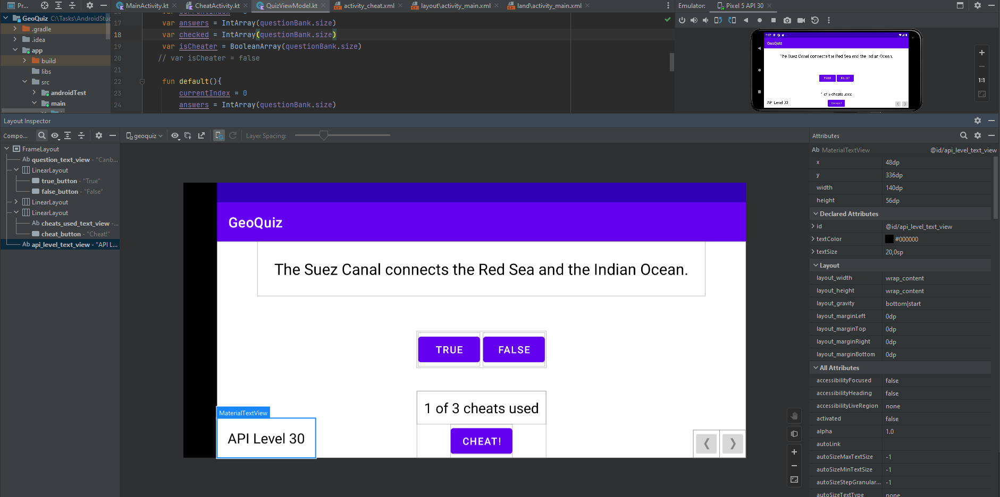
    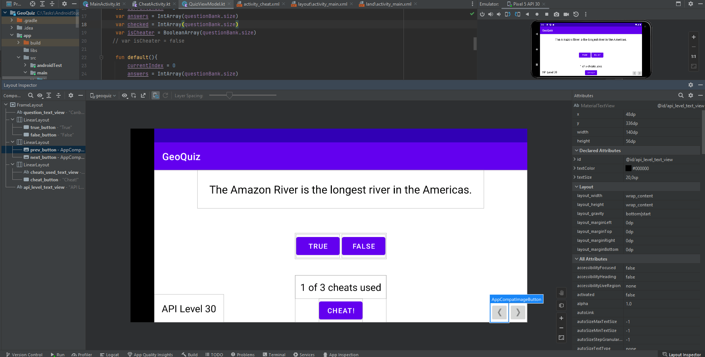
</div>
<br>

### **View ⇒ Tool Windows ⇒ Profiler**
<br>
<div align="center">
    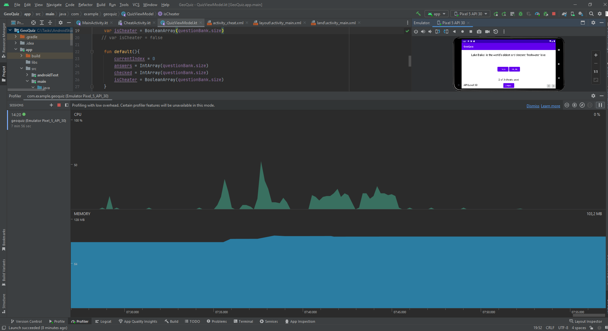
    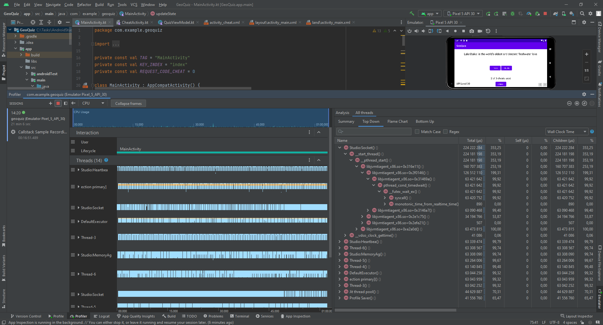
    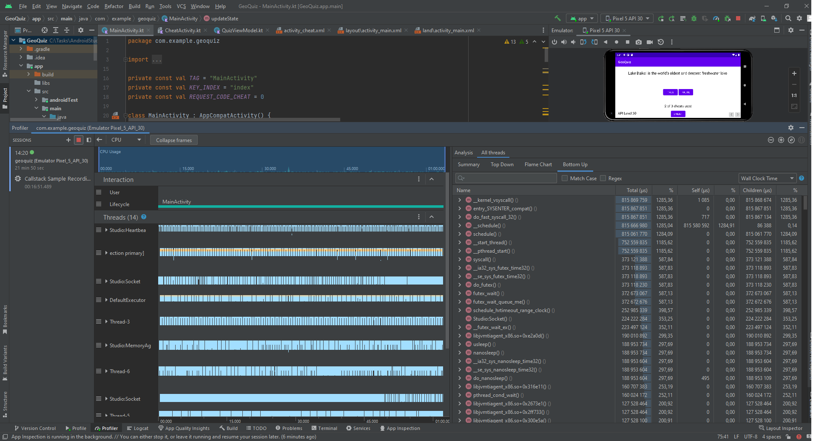
</div>


## Вывод:
В ходе выполнения задач исследовал Layout Inspector и инструмент Profiler

<br><br>

<p align = "center">МИНИСТЕРСТВО НАУКИ И ВЫСШЕГО ОБРАЗОВАНИЯ<br>
РОССИЙСКОЙ ФЕДЕРАЦИИ<br>
ФЕДЕРАЛЬНОЕ ГОСУДАРСТВЕННОЕ БЮДЖЕТНОЕ<br>
ОБРАЗОВАТЕЛЬНОЕ УЧРЕЖДЕНИЕ ВЫСШЕГО ОБРАЗОВАНИЯ<br>
«САХАЛИНСКИЙ ГОСУДАРСТВЕННЫЙ УНИВЕРСИТЕТ»</p>
<br><br><br><br><br><br>
<p align = "center">Институт естественных наук и техносферной безопасности<br>Кафедра информатики<br>Григораш Алексей Владимирович</p>
<br><br><br>
<p align = "center">Лабораторная работа № 5<br>«<strong>Вторая activity</strong>»<br>01.03.02 Прикладная математика и информатика</p>
<br><br><br><br><br><br><br><br><br><br><br><br>
<p align = "right">Научный руководитель<br>
Соболев Евгений Игоревич</p>
<br><br><br>
<p align = "center">г. Южно-Сахалинск<br>2023 г.</p>
<br><br><br><br><br><br><br><br>

## Введение:
**Android Studio** — интегрированная среда разработки производства Google, с помощью которой разработчикам становятся доступны инструменты для создания приложений на платформе Android OS


## Задачи:
**Упражнение. Лазейка для читера**

Мошенники никогда не выигрывают... Если, конечно, им не удастся обойти вашу защиту от мошенничества. А скорее всего, они так и сделают — именно потому, что они мошенники. У GeoQuiz есть кое-какая лазейка. Пользователи могут вращать CheatActivity после чита, чтобы удалить следы обмана. После возврата к MainActivity их жульничество будет забыто. Исправьте эту ошибку, сохраняя состояние пользовательского интерфейса CheatActivity во время вращения и после уничтожения процесса.

**Упражнение. Отслеживание читов по вопросу**

В настоящее время, когда пользователь читерит на одном вопросе, он считается читером по всем вопросам. Обновите GeoQuiz, чтобы отслеживать, сколько раз пользователь нарушал закон. Когда пользователь использует чит для ответа на заданный вопрос, осуждайте его всякий раз, когда он пытается ответить на этот вопрос. Когда пользователь отвечает на вопрос, с которым он не жульничал, покажите правильный или неправильный ответ.

**Codewars:**

- [Simple multiplication](https://www.codewars.com/kata/583710ccaa6717322c000105)
- [Remove String Spaces](https://www.codewars.com/kata/57eae20f5500ad98e50002c5)
- [String repeat](https://www.codewars.com/kata/57a0e5c372292dd76d000d7e)
- [Function 1 - hello world](https://www.codewars.com/kata/523b4ff7adca849afe000035)
- [Square(n) Sum](https://www.codewars.com/kata/515e271a311df0350d00000f)
- [Century From Year](https://www.codewars.com/kata/5a3fe3dde1ce0e8ed6000097)
- [Is n divisible by x and y?](https://www.codewars.com/kata/5545f109004975ea66000086)
- [Even or Odd](https://www.codewars.com/kata/53da3dbb4a5168369a0000fe)


## Решение:

### MainActivity.kt:
```kt

package com.example.geoquiz

import android.app.Activity
import android.content.Intent
import androidx.appcompat.app.AppCompatActivity
import android.os.Bundle
import android.util.Log
import android.widget.Button
import android.widget.ImageButton
import android.widget.TextView
import android.widget.Toast
import androidx.lifecycle.ViewModelProvider
import androidx.lifecycle.ViewModelProviders
import kotlin.math.roundToInt

private const val TAG = "MainActivity"
private const val KEY_INDEX = "index"
private const val REQUEST_CODE_CHEAT = 0

class MainActivity : AppCompatActivity() {

    private lateinit var questionTextView: TextView
    private lateinit var trueButton:Button
    private lateinit var falseButton:Button
    private lateinit var nextButton:ImageButton
    private lateinit var prevButton:ImageButton
    private lateinit var cheatButton: Button
    private lateinit var cheatTextView: TextView


    override fun onStart() {
        super.onStart()
        Log.d(TAG, "onStart() called")
    }
    override fun onResume() {
        super.onResume()
        Log.d(TAG, "onResume() called")
    }
    override fun onPause() {
        super.onPause()
        Log.d(TAG, "onPause() called")
    }

    override fun onSaveInstanceState(savedInstanceState: Bundle) {
        super.onSaveInstanceState(savedInstanceState)
        Log.i(TAG, "onSaveInstanceState")
        savedInstanceState.putInt(KEY_INDEX, quizViewModel.currentIndex)
    }

    override fun onStop() {
        super.onStop()
        Log.d(TAG, "onStop() called")
    }
    override fun onDestroy() {
        super.onDestroy()
        Log.d(TAG, "onDestroy() called")
    }

    private fun updateState(){
        if (quizViewModel.checked[quizViewModel.currentIndex] == 1){
            falseButton.isEnabled = false
            trueButton.isEnabled = false
        }
        else {
            falseButton.isEnabled = true
            trueButton.isEnabled = true
        }

        if (quizViewModel.checked.sum() == quizViewModel.answers.size){
            val res = "${quizViewModel.answers.sum()} of ${quizViewModel.answers.size}: ${(quizViewModel.answers.sum().toDouble() / quizViewModel.answers.size * 100).roundToInt()} %\n${quizViewModel.isCheater.count() {it}} cheats used"
            Toast.makeText(this, res, Toast.LENGTH_LONG).show()

            quizViewModel.default()

            falseButton.isEnabled = true
            trueButton.isEnabled = true
            cheatButton.isEnabled = true
        }

        cheatTextView.text = "${quizViewModel.isCheater.count() {it}} of 3 cheats used"

        if(quizViewModel.isCheater.count() {it} > 2)
            cheatButton.isEnabled = false
    }

    private fun updateQuestion() {
        //val questionTextResId = questionBank[currentIndex].textResId
        val questionTextResId = quizViewModel.currentQuestionText
        questionTextView.setText(questionTextResId)
    }

    private fun checkAnswer(userAnswer: Boolean){
        //val correctAnswer = questionBank[currentIndex].answer
//        val messageResId = if (correctAnswer == userAnswer) R.string.correct_toast
//        else R.string.incorrect_toast

        val correctAnswer: Boolean = quizViewModel.currentQuestionAnswer

        val messageResId = when {
            quizViewModel.isCheater[quizViewModel.currentIndex] -> R.string.judgment_toast
            userAnswer == correctAnswer -> R.string.correct_toast
            else -> R.string.incorrect_toast
        }

        if (correctAnswer == userAnswer)
            quizViewModel.answers[quizViewModel.currentIndex]++

        quizViewModel.checked[quizViewModel.currentIndex]++

        Toast.makeText(this, messageResId, Toast.LENGTH_SHORT).show()
    }


    private val quizViewModel: QuizViewModel by lazy {
        ViewModelProviders.of(this).get(QuizViewModel::class.java)
    }

    override fun onCreate(savedInstanceState: Bundle?) {
        super.onCreate(savedInstanceState)
        Log.d(TAG, "onCreate(Bundle?) called")
        setContentView(R.layout.activity_main)


        val currentIndex = savedInstanceState?.getInt(KEY_INDEX, 0) ?: 0
        quizViewModel.currentIndex = currentIndex

        val provider: ViewModelProvider = ViewModelProviders.of(this)
        val quizViewModel = provider.get(QuizViewModel::class.java)
        Log.d(TAG, "Got a QuizViewModel: $quizViewModel")


        trueButton = findViewById(R.id.true_button)
        falseButton = findViewById(R.id.false_button)
        nextButton = findViewById(R.id.next_button)
        prevButton = findViewById(R.id.prev_button)
        cheatButton = findViewById(R.id.cheat_button)
        questionTextView = findViewById(R.id.question_text_view)
        cheatTextView = findViewById(R.id.cheats_used_text_view)

        val apiLevelTextView: TextView = findViewById(R.id.api_level_text_view)
        apiLevelTextView.text = "API Level ${android.os.Build.VERSION.SDK_INT}"


        trueButton.setOnClickListener {
            checkAnswer(true)
            updateState()
            updateQuestion()
        }

        falseButton.setOnClickListener {
            checkAnswer(false)
            updateState()
            updateQuestion()
        }

        questionTextView.setOnClickListener {
            quizViewModel.moveToNext()
            updateState()
            updateQuestion()
        }

        nextButton.setOnClickListener{
            quizViewModel.moveToNext()
            updateState()
            updateQuestion()
        }

        prevButton.setOnClickListener{
            quizViewModel.moveBack()
            updateState()
            updateQuestion()
        }

        cheatButton.setOnClickListener {
            val answerIsTrue = quizViewModel.currentQuestionAnswer
            val intent = CheatActivity.newIntent(this@MainActivity, answerIsTrue)

            startActivityForResult(intent, REQUEST_CODE_CHEAT)
        }

        updateState()
        updateQuestion()

        Log.d(TAG, "Current question index: $currentIndex")
        try {
            val question = quizViewModel.currentQuestionText
        } catch (ex: ArrayIndexOutOfBoundsException) {
            Log.e(TAG, "Index was out of bounds", ex)
        }

    }

    override fun onActivityResult(requestCode: Int,
                                  resultCode: Int,
                                  data: Intent?) {
        super.onActivityResult(requestCode, resultCode, data)
        if (resultCode != Activity.RESULT_OK) {
            return
        }
        if (requestCode == REQUEST_CODE_CHEAT) {
            quizViewModel.isCheater[quizViewModel.currentIndex] =
                data?.getBooleanExtra(EXTRA_ANSWER_SHOWN, false) ?: false
        }
    }
}


```

### CheatActivity.kt:

```kt

package com.example.geoquiz

import android.app.Activity
import android.content.Context
import android.content.Intent
import androidx.appcompat.app.AppCompatActivity
import android.os.Bundle
import android.util.Log
import android.widget.Button
import android.widget.TextView


private const val TAG = "CheatActivity"
private const val KEY_INDEX = "answer"

const val EXTRA_ANSWER_SHOWN = "com.bignerdranch.android.geoquiz.answer_shown"
private const val EXTRA_ANSWER_IS_TRUE =
    "com.bignerdranch.android.geoquiz.answer_is_true"

class CheatActivity : AppCompatActivity() {

    private lateinit var answerTextView: TextView
    private lateinit var showAnswerButton: Button
    private var answerIsTrue = false
    private var didYouCheat = false


    override fun onCreate(savedInstanceState: Bundle?) {
        super.onCreate(savedInstanceState)
        setContentView(R.layout.activity_cheat)

        val apiLevelTextView: TextView = findViewById(R.id.api_level_text_view)
        apiLevelTextView.text = "API Level ${android.os.Build.VERSION.SDK_INT}"

        didYouCheat = savedInstanceState?.getBoolean(KEY_INDEX, false) ?: false
        setAnswerShownResult(didYouCheat)

        answerIsTrue = intent.getBooleanExtra(EXTRA_ANSWER_IS_TRUE, false)
        answerTextView = findViewById(R.id.answer_text_view)
        showAnswerButton = findViewById(R.id.show_answer_button)

        showAnswerButton.setOnClickListener {
            val answerText = when {
                answerIsTrue -> R.string.true_button
                else -> R.string.false_button
            }
            answerTextView.setText(answerText)
            didYouCheat = true
            setAnswerShownResult(true)
        }

    }


    private fun setAnswerShownResult(isAnswerShown: Boolean) {
        val data = Intent().apply {
            putExtra(EXTRA_ANSWER_SHOWN, isAnswerShown)
        }
        setResult(Activity.RESULT_OK, data)
    }


    companion object {
        fun newIntent(packageContext: Context, answerIsTrue: Boolean): Intent {
            return Intent(packageContext, CheatActivity::class.java).apply {
                putExtra(EXTRA_ANSWER_IS_TRUE, answerIsTrue)
            }
        }
    }

    override fun onSaveInstanceState(savedInstanceState: Bundle) {
        super.onSaveInstanceState(savedInstanceState)
        Log.i(TAG, "onSaveInstanceState")
        savedInstanceState.putBoolean(KEY_INDEX, didYouCheat)
    }

}

```

# codewars: https://www.codewars.com/users/thejiexa/completed
<div align="center">
    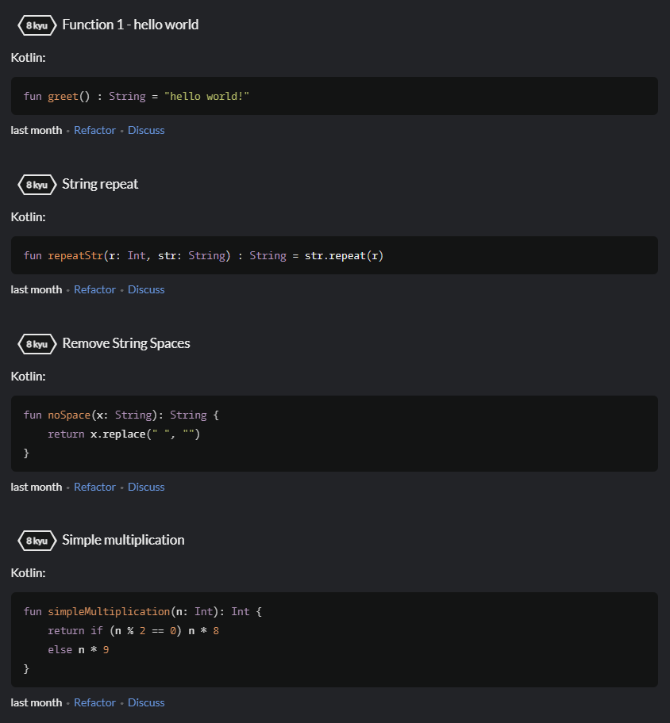
    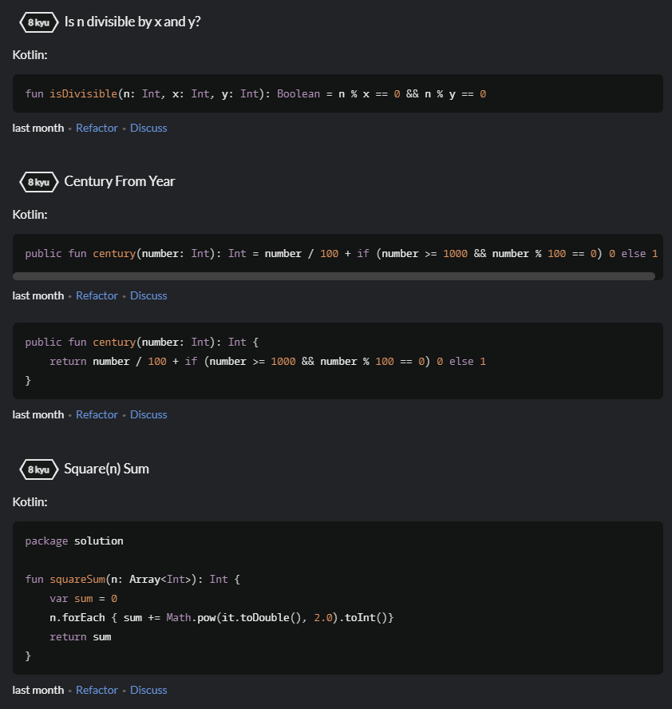
    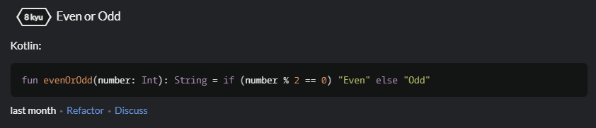
</div>

## Вывод:
В ходе выполнения задач изучил, как сохранить состояние пользовательского интерфейса CheatActivity во время вращения и после уничтожения процесса.

<br><br>


<p align = "center">МИНИСТЕРСТВО НАУКИ И ВЫСШЕГО ОБРАЗОВАНИЯ<br>
РОССИЙСКОЙ ФЕДЕРАЦИИ<br>
ФЕДЕРАЛЬНОЕ ГОСУДАРСТВЕННОЕ БЮДЖЕТНОЕ<br>
ОБРАЗОВАТЕЛЬНОЕ УЧРЕЖДЕНИЕ ВЫСШЕГО ОБРАЗОВАНИЯ<br>
«САХАЛИНСКИЙ ГОСУДАРСТВЕННЫЙ УНИВЕРСИТЕТ»</p>
<br><br><br><br><br><br>
<p align = "center">Институт естественных наук и техносферной безопасности<br>Кафедра информатики<br>Григораш Алексей Владимирович</p>
<br><br><br>
<p align = "center">Лабораторная работа № 6<br>«<strong>Версии Android SDK и совместимость</strong>»<br>01.03.02 Прикладная математика и информатика</p>
<br><br><br><br><br><br><br><br><br><br><br><br>
<p align = "right">Научный руководитель<br>
Соболев Евгений Игоревич</p>
<br><br><br>
<p align = "center">г. Южно-Сахалинск<br>2023 г.</p>
<br><br><br><br><br><br><br><br>

## Введение:
**Android Studio** — интегрированная среда разработки производства Google, с помощью которой разработчикам становятся доступны инструменты для создания приложений на платформе Android OS

## Задачи:
**Упражнение. Вывод версии Android на устройстве**

Добавьте в макет GeoQuiz виджет TextView для вывода уровня API устройства, на котором работает программа. На рисунке показано, как должен выглядеть результат.

<div align="center">
    <!--  -->
    
</div>

 
Результат упражнения Задать текст TextView в макете не получится, потому что версия операционной системы устройства не известна до момента выполнения. Найдите функцию TextView для задания текста в справочной странице TextView в документации Android. Вам нужна функция, получающая один аргумент — строку (или CharSequence). Для настройки размера и гарнитуры текста используйте атрибуты XML, перечисленные в описании TextView.

**Упражнение. Ограничение подсказок**

Ограничьте пользователя тремя подсказками. Храните информацию о том, сколько раз пользователь подсматривал ответ, и выводите количество оставшихся подсказок под кнопкой. Если ни одной подсказки не осталось, то кнопка получения подсказки блокируется.


**Codewars:**
- [Alphabet war](https://www.codewars.com/kata/59377c53e66267c8f6000027)
- [The 'spiraling' box](https://www.codewars.com/kata/63b84f54693cb10065687ae5)
- [Count the Digit](https://www.codewars.com/kata/566fc12495810954b1000030)
- [Fix string case](https://www.codewars.com/kata/5b180e9fedaa564a7000009a)
- [Geometric Progression Sequence](https://www.codewars.com/kata/55caef80d691f65cb6000040)
- [Sum of odd numbers](https://www.codewars.com/kata/55fd2d567d94ac3bc9000064)


## Решение:

### CheatActivity.kt:

```kt

package com.example.geoquiz

import android.app.Activity
import android.content.Intent
import androidx.appcompat.app.AppCompatActivity
import android.os.Bundle
import android.util.Log
import android.widget.Button
import android.widget.ImageButton
import android.widget.TextView
import android.widget.Toast
import androidx.lifecycle.ViewModelProvider
import androidx.lifecycle.ViewModelProviders
import kotlin.math.roundToInt

private const val TAG = "MainActivity"
private const val KEY_INDEX = "index"
private const val REQUEST_CODE_CHEAT = 0

class MainActivity : AppCompatActivity() {

    private lateinit var questionTextView: TextView
    private lateinit var trueButton:Button
    private lateinit var falseButton:Button
    private lateinit var nextButton:ImageButton
    private lateinit var prevButton:ImageButton
    private lateinit var cheatButton: Button
    private lateinit var cheatTextView: TextView


    override fun onStart() {
        super.onStart()
        Log.d(TAG, "onStart() called")
    }
    override fun onResume() {
        super.onResume()
        Log.d(TAG, "onResume() called")
    }
    override fun onPause() {
        super.onPause()
        Log.d(TAG, "onPause() called")
    }

    override fun onSaveInstanceState(savedInstanceState: Bundle) {
        super.onSaveInstanceState(savedInstanceState)
        Log.i(TAG, "onSaveInstanceState")
        savedInstanceState.putInt(KEY_INDEX, quizViewModel.currentIndex)
    }

    override fun onStop() {
        super.onStop()
        Log.d(TAG, "onStop() called")
    }
    override fun onDestroy() {
        super.onDestroy()
        Log.d(TAG, "onDestroy() called")
    }

    private fun updateState(){
        if (quizViewModel.checked[quizViewModel.currentIndex] == 1){
            falseButton.isEnabled = false
            trueButton.isEnabled = false
        }
        else {
            falseButton.isEnabled = true
            trueButton.isEnabled = true
        }

        if (quizViewModel.checked.sum() == quizViewModel.answers.size){
            val res = "${quizViewModel.answers.sum()} of ${quizViewModel.answers.size}: ${(quizViewModel.answers.sum().toDouble() / quizViewModel.answers.size * 100).roundToInt()} %\n${quizViewModel.isCheater.count() {it}} cheats used"
            Toast.makeText(this, res, Toast.LENGTH_LONG).show()

            quizViewModel.default()

            falseButton.isEnabled = true
            trueButton.isEnabled = true
            cheatButton.isEnabled = true
        }

        cheatTextView.text = "${quizViewModel.isCheater.count() {it}} of 3 cheats used"

        if(quizViewModel.isCheater.count() {it} > 2)
            cheatButton.isEnabled = false
    }

    private fun updateQuestion() {
        //val questionTextResId = questionBank[currentIndex].textResId
        val questionTextResId = quizViewModel.currentQuestionText
        questionTextView.setText(questionTextResId)
    }

    private fun checkAnswer(userAnswer: Boolean){
        //val correctAnswer = questionBank[currentIndex].answer
//        val messageResId = if (correctAnswer == userAnswer) R.string.correct_toast
//        else R.string.incorrect_toast

        val correctAnswer: Boolean = quizViewModel.currentQuestionAnswer

        val messageResId = when {
            quizViewModel.isCheater[quizViewModel.currentIndex] -> R.string.judgment_toast
            userAnswer == correctAnswer -> R.string.correct_toast
            else -> R.string.incorrect_toast
        }

        if (correctAnswer == userAnswer)
            quizViewModel.answers[quizViewModel.currentIndex]++

        quizViewModel.checked[quizViewModel.currentIndex]++

        Toast.makeText(this, messageResId, Toast.LENGTH_SHORT).show()
    }


    private val quizViewModel: QuizViewModel by lazy {
        ViewModelProviders.of(this).get(QuizViewModel::class.java)
    }

    override fun onCreate(savedInstanceState: Bundle?) {
        super.onCreate(savedInstanceState)
        Log.d(TAG, "onCreate(Bundle?) called")
        setContentView(R.layout.activity_main)


        val currentIndex = savedInstanceState?.getInt(KEY_INDEX, 0) ?: 0
        quizViewModel.currentIndex = currentIndex

        val provider: ViewModelProvider = ViewModelProviders.of(this)
        val quizViewModel = provider.get(QuizViewModel::class.java)
        Log.d(TAG, "Got a QuizViewModel: $quizViewModel")


        trueButton = findViewById(R.id.true_button)
        falseButton = findViewById(R.id.false_button)
        nextButton = findViewById(R.id.next_button)
        prevButton = findViewById(R.id.prev_button)
        cheatButton = findViewById(R.id.cheat_button)
        questionTextView = findViewById(R.id.question_text_view)
        cheatTextView = findViewById(R.id.cheats_used_text_view)

        val apiLevelTextView: TextView = findViewById(R.id.api_level_text_view)
        apiLevelTextView.text = "API Level ${android.os.Build.VERSION.SDK_INT}"


        trueButton.setOnClickListener {
            checkAnswer(true)
            updateState()
            updateQuestion()
        }

        falseButton.setOnClickListener {
            checkAnswer(false)
            updateState()
            updateQuestion()
        }

        questionTextView.setOnClickListener {
            quizViewModel.moveToNext()
            updateState()
            updateQuestion()
        }

        nextButton.setOnClickListener{
            quizViewModel.moveToNext()
            updateState()
            updateQuestion()
        }

        prevButton.setOnClickListener{
            quizViewModel.moveBack()
            updateState()
            updateQuestion()
        }

        cheatButton.setOnClickListener {
            val answerIsTrue = quizViewModel.currentQuestionAnswer
            val intent = CheatActivity.newIntent(this@MainActivity, answerIsTrue)

            startActivityForResult(intent, REQUEST_CODE_CHEAT)
        }

        updateState()
        updateQuestion()

        Log.d(TAG, "Current question index: $currentIndex")
        try {
            val question = quizViewModel.currentQuestionText
        } catch (ex: ArrayIndexOutOfBoundsException) {
            Log.e(TAG, "Index was out of bounds", ex)
        }

    }

    override fun onActivityResult(requestCode: Int,
                                  resultCode: Int,
                                  data: Intent?) {
        super.onActivityResult(requestCode, resultCode, data)
        if (resultCode != Activity.RESULT_OK) {
            return
        }
        if (requestCode == REQUEST_CODE_CHEAT) {
            quizViewModel.isCheater[quizViewModel.currentIndex] =
                data?.getBooleanExtra(EXTRA_ANSWER_SHOWN, false) ?: false
        }
    }
}


```

### QuizViewModel.kt:

```kt

package com.example.geoquiz

import androidx.lifecycle.ViewModel

class QuizViewModel : ViewModel() {

    private val questionBank = listOf(
        Question(R.string.question_australia, true),
        Question(R.string.question_oceans, true),
        Question(R.string.question_mideast, false),
        Question(R.string.question_africa, false),
        Question(R.string.question_americas, true),
        Question(R.string.question_asia, true)
    )

    var currentIndex = 0
    var answers = IntArray(questionBank.size)
    var checked = IntArray(questionBank.size)
    var isCheater = BooleanArray(questionBank.size)
   // var isCheater = false

    fun default(){
        currentIndex = 0
        answers = IntArray(questionBank.size)
        checked = IntArray(questionBank.size)
        isCheater = BooleanArray(questionBank.size)
    }

    val currentQuestionAnswer: Boolean
        get() = questionBank[currentIndex].answer
    val currentQuestionText: Int
        get() = questionBank[currentIndex].textResId

    fun moveToNext() {
        if (currentIndex < questionBank.size - 1)
            currentIndex = (currentIndex + 1) % questionBank.size
    }

    fun moveBack(){
        if (currentIndex > 0)
            currentIndex = (currentIndex - 1) % questionBank.size
    }

}

```


## codewars: https://www.codewars.com/users/thejiexa/completed

<div align="center">
    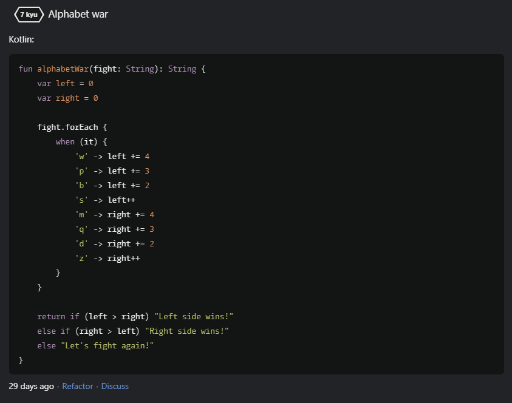
    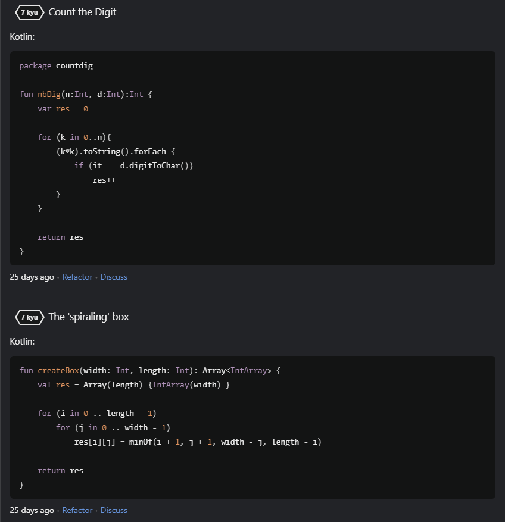
    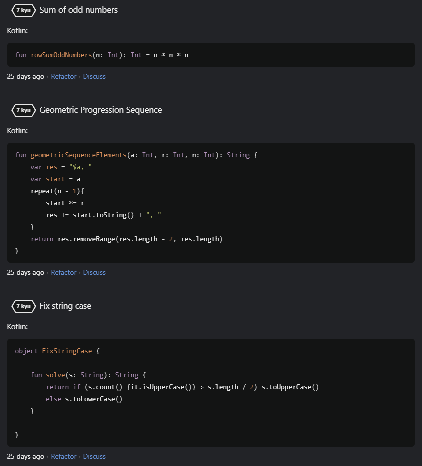
</div>


## Вывод:
В ходе выполнения задач узнал, как вывести уровнень API устройства, на котором работает программа